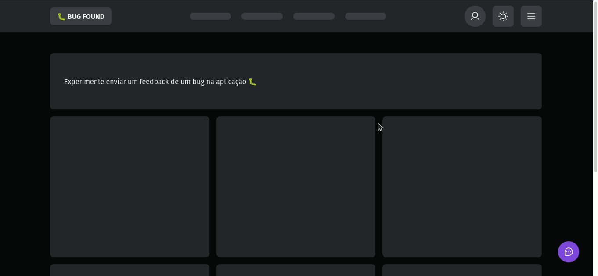
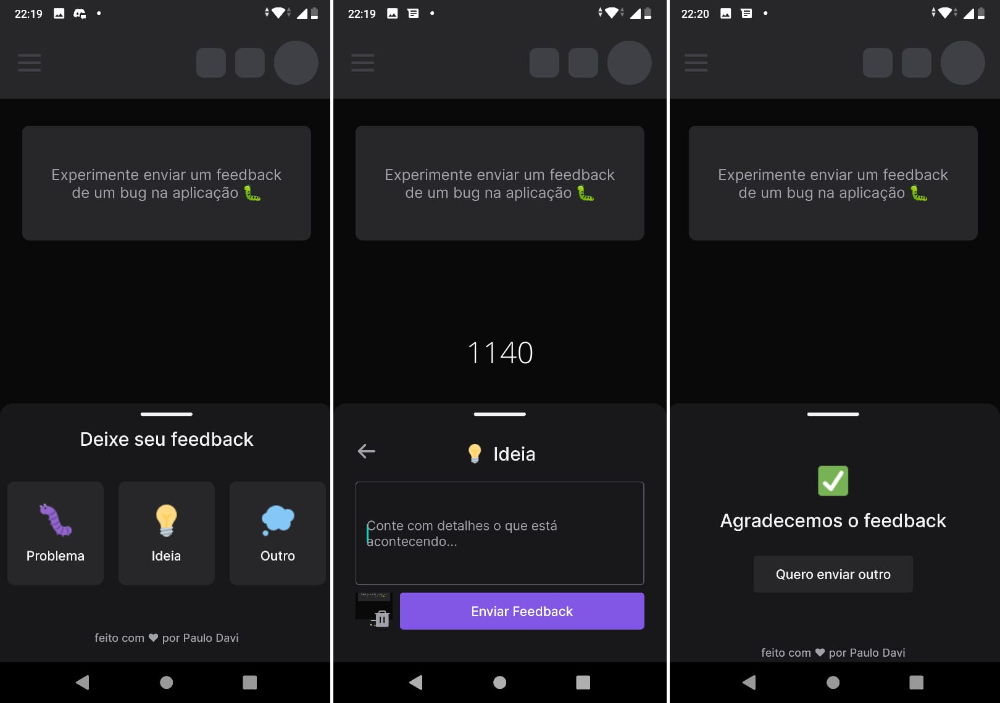

# Feedback (Projeto NLW Return)

Projeto fullstack com front-end back-end e mobile realizado durante o evento [NLW Return](https://lp.rocketseat.com.br/nlw-return), da [Rocketseat](https://www.rocketseat.com.br/). Muito conhecimento sobre a stack React, Node e ReactNative adquirido, o desafio de replicar o [template do figma](https://www.figma.com/community/file/1102912516166573468/Feedback-Widget) perfeitamente (pixel perfect) e a cereja do bolo foi a parte de deploy utilizando a vercel e railway.

## Server
Servidor ([mais informações](./server/README.md)) em Node e Typescript.

## Web

Front-end ([mais informações](./web/README.md)) feito com React e Vite, [Demo](https://nlw-return-jet.vercel.app/).

## Mobile

Aplicação mobile ([mais informações](./mobile/README.md)) feita com ReactNative e Expo.

